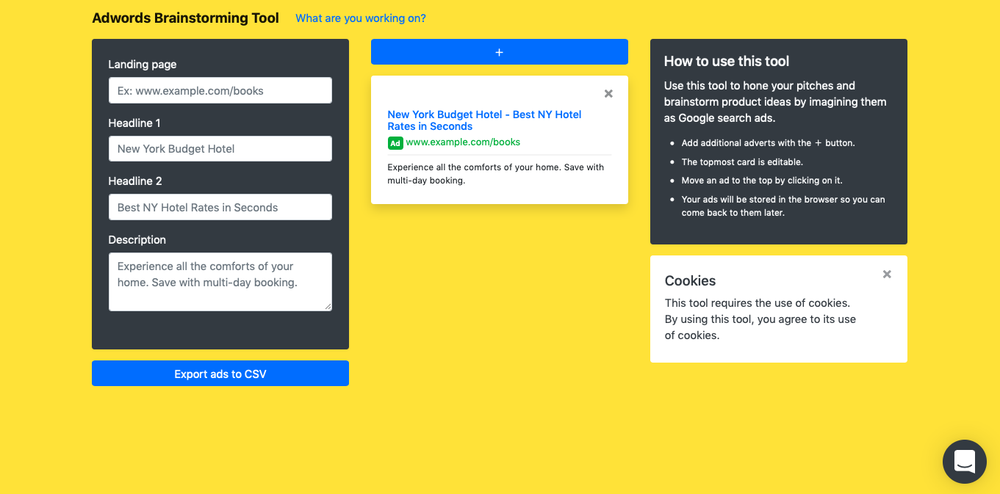

# Adwords Brainstorming Tool

The tool replicates Google's Adwords form and allows the user to create multiple mockup ads.

Use this tool to hone your pitches and brainstorm product ideas by imagining them as Google search ads.

- Add additional adverts with the ＋ button.
- The topmost card is editable.
- Move an ad to the top by clicking on it.
- Your ads will be stored in the browser so you can come back to them later.

